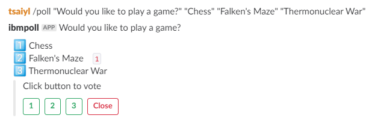

# slack-poll-app

A simple slack polling app which can be deployed in your own environment.




## Current Features

- One active poll per channel
- Polls stored in-memory or cloudant
- Anonymous votes only


## How to use

1. Acquire local credentials for authenticating with Google Cloud Platform APIs:
    ```gcloud auth application-default login```

2. Deploy the application  
    ```npm run deploy```
3. Install dependencies

    ```npm install```
    
4. [Create a slack app](https://api.slack.com/apps?new_app=1)

5. In the slack app, create a slash command:

    - Command: `/poll` or another command
    - Request URL: `https://your-slack-app-route/slack/command`, where route is obtained from Step 1.
    - Short Description: `Simple polling app self hosted`
    - Usage Hint: `"Would you like to play a game?"  "Chess"  "Falken's Maze"  "Thermonuclear War"`

4. Go to **Interactive Components**, and set Request URL to `https://your-slack-app-route/slack/action`

5. Go to **Basic Information**, write down **Client ID**, **Client Secret** and **Verification Token**

6. Go to **OAuth & Permissions**, insert redirect_url: https://your-slack-app-route/slack/auth/redirect

7. In the app.yaml, set env var **CLIENT_ID**, **CLIENT_SECRET** and **VERIFY_TOKEN**


## Install app to your slack workspace

1. Visit https://your-slack-app-route with browser

2. Click **Add to Slack** button

3. Confirm the authorization

4. After slack redirects back, if you see a message "Success!", you have installed the app to your slack workspace.

5. Check whether `poll` command shows up in your slack workspace.


